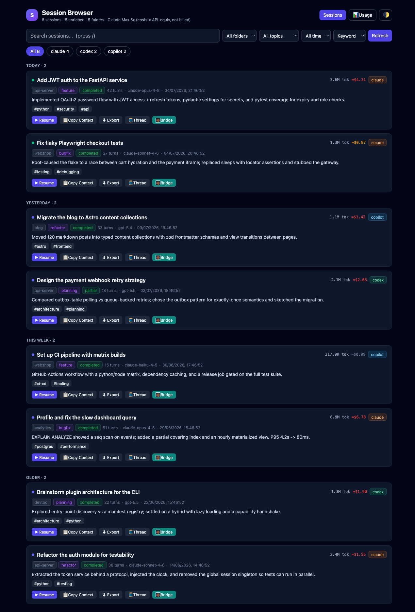
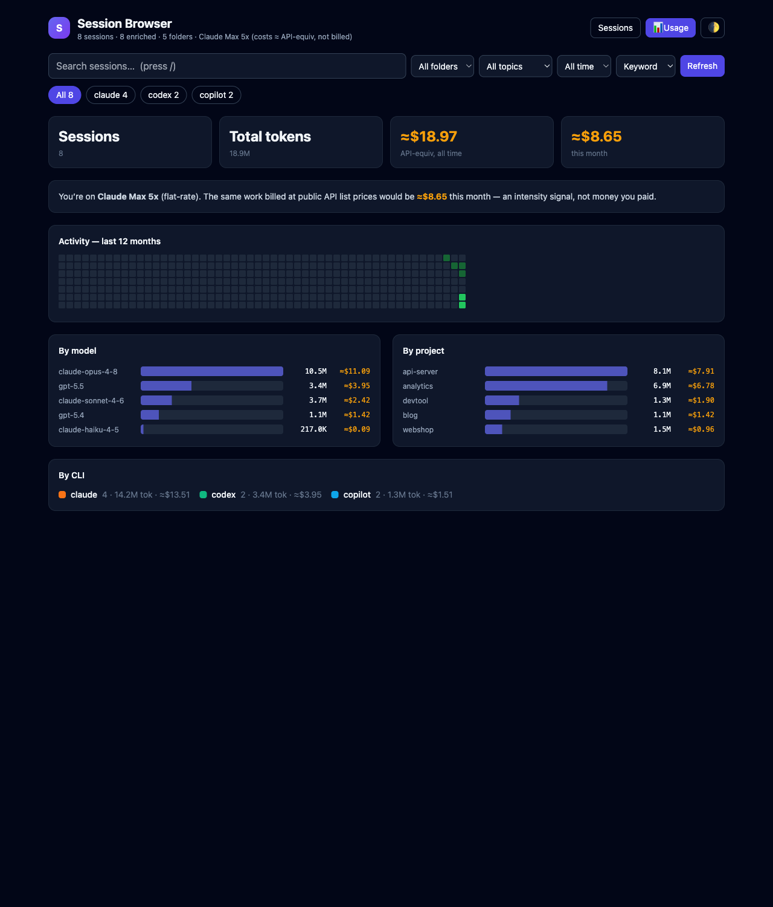

# Session Browser

**One local, private home for every AI coding session** — across Claude Code,
GitHub Copilot CLI, and Codex. Search everything, see what each session *would*
have cost on the API, resume any session from any directory, hand a session off
between CLIs, and read a decision/reasoning trail for every one.

[](https://github.com/mpankaj151/session-browser/actions/workflows/ci.yml)


Everything runs and stays on your machine: SQLite + Flask + vanilla JS + numpy.
No cloud services, no telemetry, no external requests — the UI even works offline.



## Why

If you run several AI CLIs and long, multi-day sessions, your work scatters
across `~/.claude`, `~/.copilot`, and `~/.codex` in formats you can't search,
resume from elsewhere, or carry between tools. Session Browser unifies them into
one searchable index and adds the things the CLIs don't give you:

- **"What would this have cost on the API?"** — real token volume + public
  list-price equivalent, so a flat-rate Max/Pro plan finally has a usage signal.
- **Resume from anywhere** — not just the original project directory.
- **Port a session to another CLI** — Claude → Copilot → Codex handoff.
- **A reasoning trail** — how each session actually reached its decisions.

## Quick start

```bash
curl -fsSL https://raw.githubusercontent.com/mpankaj151/session-browser/main/bootstrap.sh | bash
source ~/.zshrc
sb ui          # http://127.0.0.1:7655
```

No sessions yet? See the whole thing with synthetic data:

```bash
sb demo
```

Prefer to clone first? See [docs/SETUP.md](docs/SETUP.md) for the manual install,
Linux scheduling, the MCP server, and a troubleshooting matrix.

```bash
git clone https://github.com/mpankaj151/session-browser.git && cd session-browser
./install.sh          # --lite skips the ~2 GB semantic-search stack
./bin/install-cr.sh   # adds cr / sb shell shortcuts
```

## Shell shortcuts

```bash
cr <session_id>       # resume ANY session in the CURRENT directory
sb ui                 # start the web UI
sb stats              # ccusage-style usage report in the terminal
sb demo               # launch a synthetic-data demo
sb doctor             # health check
sb refresh [--enrich] # run the indexing pipeline now
```

## Features

### Usage dashboard — the shareable one

A GitHub-style activity heatmap, per-day/model/project/CLI token and cost
breakdowns, and the headline number: *"the same work billed at public API list
prices would be ≈$X this month"* — an intensity signal, not money you paid on a
flat plan.



Also available in the terminal: `sb stats` (today / 7d / 30d / all).

### Search everything, three ways

**Keyword** (title/summary/topics), **Semantic** (vector similarity), and
**Full-text** (FTS5 over the actual conversation — find sessions by what was
*discussed*). Filter by folder, source, topic, or time.

### Resume from anywhere — `cr <session_id>`

A plain `claude --resume` only works from the session's original directory. `cr`
ports the session's memory to wherever you are, then resumes — Claude (symlink
into the encoded project dir), Copilot (repoint workspace cwd), Codex (resume in
place). The UI's **Resume** button copies exactly this command.

### The reasoning / decision trail

For each session, a turn-by-turn reconstruction of the **visible reasoning** and
the **exact action sequence** — a readable Markdown trail per session, plus raw +
readable archives under `~/claude-reasoning-archive/`.

> **Honest limitation:** Claude Code and Codex store extended thinking without
> its text (only a signature / encrypted blob), so the *internal* chain-of-thought
> isn't recoverable. The trail captures visible reasoning + actions and flags
> turns where hidden thinking occurred. Copilot *does* persist `reasoningText`.

### Bridge — hand a session to another CLI

No CLI can natively resume another's session, so **🌉 Bridge** writes a
target-specific handoff primer and a command that starts a fresh session in the
other CLI, in the same project dir, seeded with the full context.

### Carry context between sessions

**📋 Copy Context** / **⬇ Export** build a portable markdown primer — goal,
summary, topics, key decisions, recent reasoning, tokens/cost, the resume
command, and pointers to the transcript + trail.

### Privacy: secret redaction

Every primer that leaves the tool (Copy, Export, Bridge), the full-text index,
and the reasoning archive pass through `redact.py`, which masks API keys, tokens
(`sk-`, `github_pat_`, `npm_`, `xox*`, AWS, Google, JWT, bearer),
`*_SECRET`/`*_KEY` assignments (including JSON form), and private-key blocks.

### MCP server — let Claude recall past work

Six stdio tools (`search_sessions`, `get_session_summary`, `get_session_snippet`,
`list_recent`, `get_decisions`, `get_reasoning`). Registration in
[docs/SETUP.md](docs/SETUP.md).

## How it stays fresh

- **Stop hook** indexes a Claude session the moment it ends (always exits 0 — it
  can never block your session).
- **Watcher** (launchd daemon) catches Copilot/Codex and anything else via
  filesystem events.
- **Nightly refresh** (01:00) runs the full pipeline: costs, reasoning, full-text,
  embeddings, LLM summaries.

macOS wires these via launchd automatically; Linux uses systemd/cron (commands in
[docs/SETUP.md](docs/SETUP.md)).

## Supported CLIs

| CLI | Index | Cost | Reasoning | Resume | Bridge |
|-----|:--:|:--:|:--:|:--:|:--:|
| Claude Code | ✅ | ✅ | ✅ visible + flagged | ✅ | ✅ |
| GitHub Copilot CLI | ✅ | ✅ | ✅ real reasoning text | ✅ | ✅ |
| Codex CLI | ✅ | ✅ | ✅ visible + flagged | ✅ | ✅ |

Adding another (Gemini, OpenCode, Aider, Ollama, …) is one file — see
[docs/ADDING-A-CLI.md](docs/ADDING-A-CLI.md).

## Roadmap

- Daily digest / auto-standup from the day's sessions
- Decision-trail → PR description export
- Gemini CLI, OpenCode, Aider adapters
- Budget alerts on notional spend
- Homebrew / pipx packaging

Contributions welcome — see [CONTRIBUTING.md](CONTRIBUTING.md).

## Docs

- [SETUP.md](docs/SETUP.md) — install, Linux scheduling, MCP, troubleshooting
- [ARCHITECTURE.md](docs/ARCHITECTURE.md) — data flow + design decisions
- [ADDING-A-CLI.md](docs/ADDING-A-CLI.md) — write an adapter in one file

## License

MIT — see [LICENSE](LICENSE).
