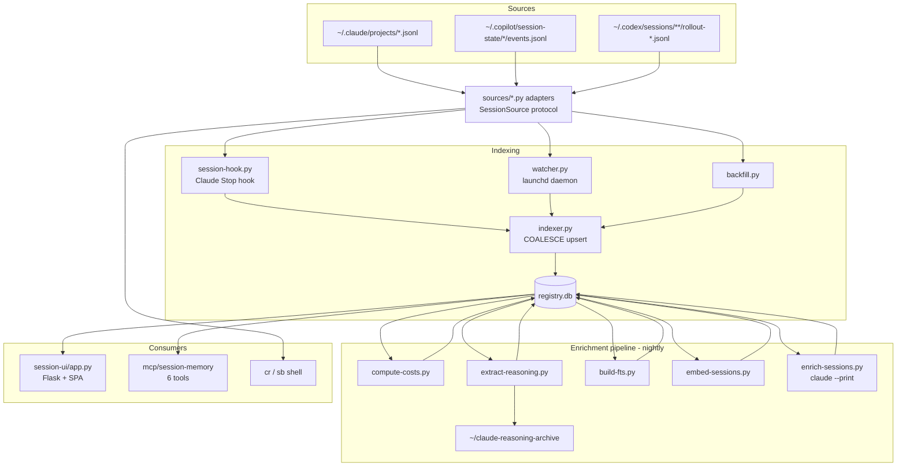

# Architecture

Session Browser is a local pipeline that indexes AI-CLI transcripts into one
SQLite database, plus a Flask UI and an MCP server on top. Everything is
source-agnostic behind an adapter protocol.

## Data flow



## Key design decisions

**Adapter protocol (`sources/base.py`).** Every CLI implements `SessionSource`:
`discover`, `parse_header` (cheap, no full read), `parse_full`,
`session_id_for_path` (identity without reading — used on delete),
`resume_command`, `is_available`. The indexer, DB, UI, watcher, and MCP server
never mention a specific CLI — adding one is a new file + one registry line.

**COALESCE upsert (`indexer.py`).** Re-indexing a session must never clobber
enrichment (summary, topics, cost, reasoning_path). The upsert updates cheap
fields (last_activity, turn_count) but `COALESCE(NULLIF(old,''), NULLIF(new,''))`
preserves everything derived, and treats `''` as absent so a header parsed
before the first user turn doesn't pin a field empty. Every upsert also sets
`archived=0` — a parsed file exists, so the session is alive.

**Two-tier live indexing.** The Claude **Stop hook** indexes a session the
instant it ends (tens of ms) and detaches reasoning extraction. The **watcher**
(a launchd daemon, singleton-locked) catches everything else — Copilot, Codex,
and anything the hook missed — via filesystem events, with a 30s race-guard so
the two paths never double-process. The hook is contractually exit-0 so a broken
config can never block Claude Code's session end.

**Timestamps.** `to_iso_utc()` normalizes every source to one canonical,
lexicographically-sortable UTC form, so mixed Claude/Copilot/Codex lists order
correctly under a plain `ORDER BY`.

**Vector search without a native extension.** pyenv's `sqlite3` can't load
`sqlite-vec`, so embeddings are stored as float32 BLOBs and searched with a
numpy brute-force cosine — trivially fast for thousands of sessions. If an
extension-capable interpreter is present, the `sessions_vec` fast path is used
automatically. The stored `dim` is the true vector length, so changing
`[embeddings].model` triggers a clean re-embed instead of a crash.

**Redaction at every egress.** Anything that leaves the tool — Copy Context,
Export, Bridge, the full-text index, and the reasoning archive — passes through
`redact.py`, which masks API keys, tokens (`sk-`, `github_pat_`, `npm_`, `xox*`,
AWS, Google, JWTs, bearer tokens), `*_SECRET`/`*_KEY` assignments (including
JSON form), and private-key blocks. Bare hashes in prose survive so the FTS
index stays searchable by commit SHA.

**Cost is notional under a subscription.** Token totals are real; the dollar
figure is the public-API list-price equivalent. Under a flat plan (`[billing]
mode = "subscription"`) it's shown with `≈` as an intensity signal, not money
billed.

## Storage

| What | Where |
|------|-------|
| Registry (sessions, artifacts, embeddings, FTS) | `~/.session-browser/registry.db` (WAL) |
| Enrichment facets / bridge primers | `~/.session-browser/{facets,bridges}/` |
| Raw transcripts + readable reasoning trails | `~/claude-reasoning-archive/{raw,readable}/YYYY/MM/` |

## Module map

```
sources/{base,claude,copilot,codex,registry}.py   adapters + protocol
indexer.py                                         upsert / archive
watcher.py + scripts/session-hook.py               two-tier live indexing
reasoning.py + scripts/extract-reasoning.py        decision trails
costs.py + scripts/compute-costs.py                tokens -> USD
semsearch.py + scripts/embed-sessions.py           numpy cosine vector search
redact.py                                          secret masking
enrichment/                                         pluggable LLM summarizers
session-ui/app.py + static/                         Flask API + vanilla-JS SPA
mcp/session-memory/                                 6 MCP tools
```
